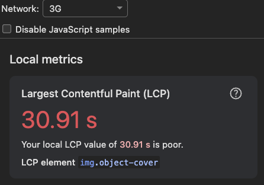
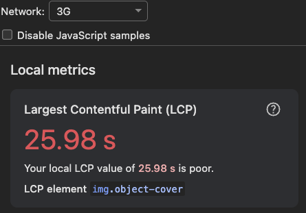
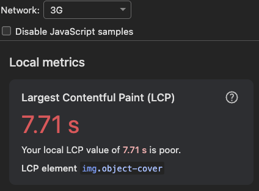

# 상품 상세 페이지 LCP 개선기

- 상품 상세 페이지가 유독 느리게 뜬다는 느낌이 들어서, LCP(Largest Contentful Paint)를 파고들어 본 기록
- 처음엔 "이미지가 무거워서겠지" 하고 접근했는데, 진짜 범인은 따로 있었음

## 1. 문제 상황

Chrome DevTools **Performance 패널**에서 네트워크를 **3G**로 스로틀링하고 페이지를 새로고침해 측정했더니, **LCP가 무려 30.91s**로 찍힘

> 측정 환경: DevTools → Performance 패널 → Network: **3G**, CPU: **No throttling** → 새로고침 후 기록



캡처를 보니 **LCP element로 `` 태그(상품 히어로 이미지)**가 잡혀 있어서 자연스럽게 "이미지가 문제구나" 하고 이미지부터 손보기로 했습니다.

## 2. 원인 분석

### 처음엔 이미지가 범인인 줄!

이미지 쪽을 보니 개선할 게 보였습니다.

- 캐러셀의 **모든 슬라이드가 같은 우선순위**로 로드돼서, 화면에 가장 먼저 보이는 첫 이미지가 우선 로드되지 않음.
- `sizes`가 없어서 프레임 최대 폭(480px)보다 **훨씬 큰 원본**을 받고 있었고, 포맷도 변환되지 않은 원본이라 용량이 컸음.

그래서 이미지를 최적화했는데... **LCP가 30.91s → 25.98s로 살짝 줄었을 뿐, 여전히 25초대**... 이미지 바이트를 줄였는데도 이 정도라니, 이미지가 아니라 다른게 문제라고 판단!

### 다시 보니 진짜 범인은 `<p>` 태그(가격)😇

LCP 자세히 다시 보니 이미지가 element로 확정되기 **직전에 가격 `<p>` 태그가 먼저 뒤늦게 페인트**되고 있었다. "왜 가격 텍스트가 저렇게 늦게 그려지지?" 싶어서 **페이지 소스(view-source)를 열어봤더니**, 초기 HTML에 **가격 값 자체가 들어있지 않았음**


- 상품 상세(`ProductPage`)는 `"use client"` 컴포넌트이고, 데이터를 `useProductDetail`(React Query, **클라이언트 fetch**)로만 조회하고 있었음.
- 라우트(`page.tsx`)는 뷰를 그냥 re-export만 할 뿐 **서버 프리페치가 없었음.**
- 그래서 서버가 내려주는 초기 HTML에는 **스켈레톤만** 담기고, 상품 데이터(가격·이미지 URL 등)는 **브라우저에서 페이지가 뜬 뒤 클라이언트 fetch가 끝나야** 비로소 렌더됨.

**이미지든 가격이든, 상품 데이터가 클라이언트에 도착해야만 렌더**되는 구조였다. 그러니 이미지 바이트를 아무리 줄여도, 이미지가 _로드를 시작할 수 있는 시점_ 자체가 "클라이언트 fetch 완료 후"로 밀려 있었던거다. 진짜 병목은 이미지 크기가 아니라 **데이터를 기다리는 구조**였다.

> 정리하면, LCP를 끌어올린 근본 원인은 이미지가 아니라 **가격·본문이 클라이언트 렌더로 밀려 늦게 페인트되는 구조**

## 3. 해결

방향을 두 축으로 잡았다.

- **이미지 페인트 자체를 빠르게** — 히어로 이미지를 우선 로드하고, 적정 크기·경량 포맷으로 다운로드 용량을 줄이기.
- **늦은 클라이언트 페인트를 제거** — 상품 데이터를 **서버에서 프리페치**해 초기 HTML에 담고, `HydrationBoundary`로 클라이언트 React Query 캐시에 넘기기. 이러면 이미지·가격이 첫 렌더부터 표시되고, LCP element도 (데이터를 기다리지 않는) 히어로 이미지로 자연스럽게 정리됨.

## 4. 구현 내용

### (1) 히어로 이미지 우선 로드 · 적정 크기 다운로드

캐러셀 첫 슬라이드에만 `priority`를 주고, `sizes`로 프레임 폭에 맞는 이미지만 받도록 했다.

```tsx
{
  images.map((src, index) => (
    <div key={src} className="relative h-full min-w-0 flex-[0_0_100%]">
      <Image
        src={src}
        alt={prdName}
        fill
        className="object-cover"
        priority={index === 0} // 첫 슬라이드만 우선 로드
        sizes="(max-width: 480px) 100vw, 480px" // 프레임 최대 폭에 맞춤
      />
    </div>
  ));
}
```

### (2) 이미지 포맷 변환 설정

`next/image`가 AVIF·WebP 같은 경량 포맷으로 변환해 내려주도록 설정해 전송 용량을 줄였다.

```ts
// next.config.ts
images: {
  formats: ["image/avif", "image/webp"],
  // ...
}
```

### (3) 상품 상세 데이터 서버 프리페치 · Hydration 적용

**1) `getProduct`를 서버·클라이언트 공용으로 변경**

내부에서 브라우저 Supabase 클라이언트를 만들던 걸 걷어내고, 클라이언트를 인자로 주입받게 바꿔서 양쪽 환경에서 재사용할 수 있게 했다.

```ts
export async function getProduct(
  supabase: SupabaseClient, // 주입받아 서버·클라 재사용
  dashboardId: string,
  productId: string
): Promise<ProductDetail | null> {
  /* 매핑 로직은 그대로 */
}
```

**2) 클라이언트 훅은 브라우저 클라이언트 주입**

```ts
queryFn: () => getProduct(createClient(), dashboardId, productId),
```

**3) 라우트를 async 서버 컴포넌트로 바꿔 프리페치 후 Hydration**

같은 `queryKey`로 서버에서 프리페치하고, `dehydrate` 결과를 `HydrationBoundary`로 넘긴다.

```tsx
export default async function Page({ params }) {
  const { dashboardId, productId } = await params;
  const supabase = await createClient(); // 서버 클라(쿠키 세션 → RLS 정상)
  const queryClient = getQueryClient();

  await queryClient.prefetchQuery({
    queryKey: queryKeys.products.detail(dashboardId, productId),
    queryFn: () => getProduct(supabase, dashboardId, productId),
  });

  return (
    <HydrationBoundary state={dehydrate(queryClient)}>
      <ProductPage />
    </HydrationBoundary>
  );
}
```

- `ProductPage`·`ProductInfo` 같은 하위 컴포넌트는 **손대지 않음.** 파라미터는 계속 `useParams`로 읽고, `useProductDetail`이 하이드레이션된 캐시를 동기적으로 사용.
- `staleTime: 60s` 덕분에 마운트 직후 재요청이 없어서 값이 깜빡이지 않음.
- `prefetchQuery`는 에러를 throw하지 않아서, 프리페치가 실패해도 기존 클라이언트 조회로 안전하게 폴백.

## 5. 결과

같은 환경(Performance 패널 / Network: 3G / CPU: No throttling)에서 단계별로 LCP를 다시 측정!

| 단계                  | LCP 값     | 비고                                                               |
| --------------------- | ---------- | ------------------------------------------------------------------ |
| 작업 전               | **30.91s** | LCP element = 히어로 이미지, 이미지·데이터 모두 미최적화           |
| 이미지 파일 개선 후   | **25.98s** | 우선 로드 + 적정 크기·경량 포맷 (그래도 여전히 느림)               |
| 서버 프리페치 적용 후 | **7.71s**  | 가격·이미지가 초기 HTML에 포함, 데이터를 기다리지 않고 바로 페인트 |




- 이미지 최적화만으로는 **30.91s → 25.98s**로 찔끔 줄임.. LCP를 실제로 붙잡고 있던 건 이미지 바이트가 아니라, **데이터 fetch를 기다리는 구조**였기 때문.
- 서버 프리페치·Hydration을 적용하니 가격·이미지가 첫 렌더부터 그려지면서 **25.98s → 7.71s**로 크게 줄음.
- 결과적으로 **30.91s → 7.71s, 약 75% 단축**. 이번 개선에서 가장 큰 몫은 "이미지 최적화"가 아니라 **"늦은 클라이언트 페인트 제거(서버 프리페치)"**에서 나옴.

## 마치며

캡처에 찍힌 LCP element만 보고 "이미지 문제"라고 단정했다면 25초대에서 멈췄을 것이다. **"이미지를 고쳤는데 왜 그대로지?"** 하는 위화감을 그냥 넘기지 않고 타임라인과 페이지 소스까지 확인한 게 실제 원인(클라이언트 렌더 지연)을 찾은 열쇠였다. 측정 도구가 가리키는 결과만 보지 말고, 그 값이 왜 그렇게 나오는지 한 겹 더 파보는 게 중요하다는 걸 다시 느낀 작업이었다.
